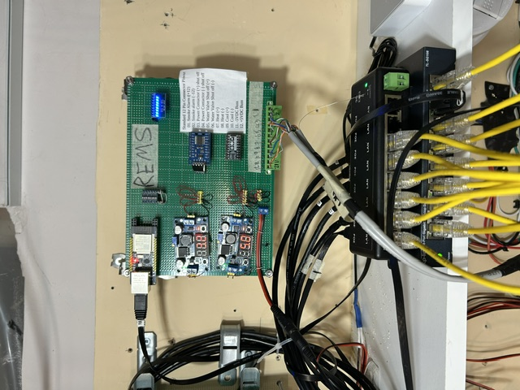
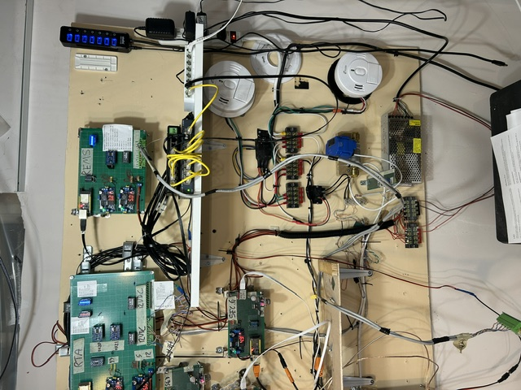
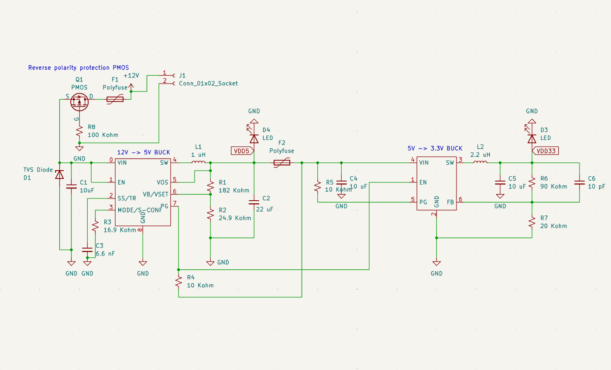
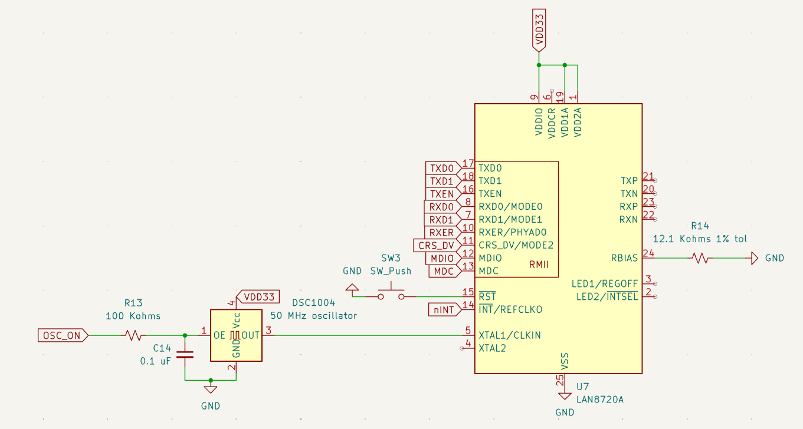
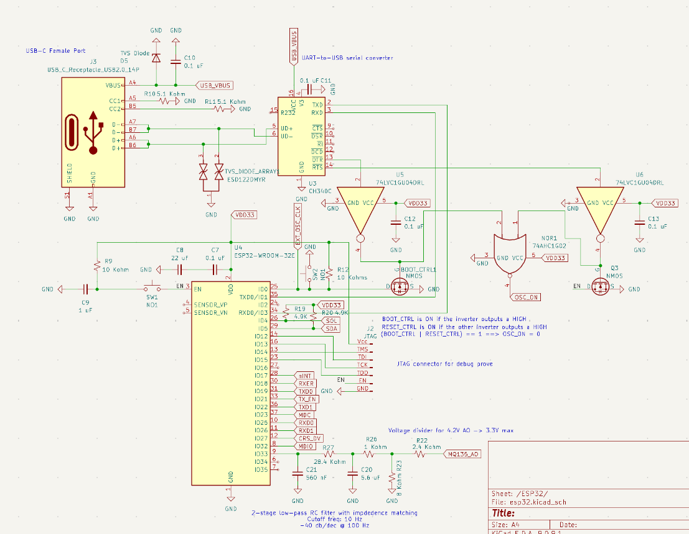
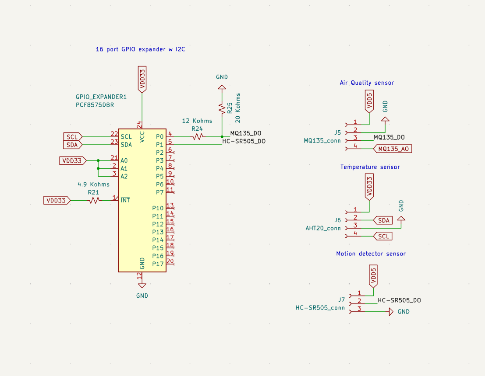

# ESP32 Ethernet Sensor Node

ESP32-S3 firmware for an Ethernet-connected sensor node intended for long-lived remote deployment in a **3000+ unit seniors village**. The system is being built as part of an in-progress large-scale sensing and maintenance workflow where nodes need stable addressing, remote observability, sensor telemetry, and reliable firmware updates without requiring physical access.

> **Hardware status note:** The current firmware targets an ESP32-S3 development module using a **W5500 SPI Ethernet controller**. The custom PCB shown below is a **Rev 1 hardware direction** that migrates the design toward an **ESP32-WROOM-32E module using the ESP32 internal Ethernet MAC with an external LAN8720A RMII PHY**. Firmware support for the LAN8720A/RMII hardware is planned after schematic/layout bring-up.

This project is written in **C using ESP-IDF** and is aimed at real embedded deployment rather than a one-off demo. The focus is on firmware architecture, networking, remote maintainability, sensor integration, and the hardware/software boundary.

## Why this project matters

This repo demonstrates:

- **Low-level embedded firmware development** on ESP32-S3 using ESP-IDF
- **Hardware bring-up** of a W5500 SPI Ethernet path on current development hardware
- **Custom PCB design direction** using ESP32 internal EMAC + LAN8720A RMII Ethernet PHY
- **Driver and peripheral integration** across SPI, GPIO, Ethernet, timers, sockets, NVS, OTA, I2C, GPIO expansion, and ADC
- **Networked firmware design** using both UDP telemetry and a TCP control console
- **Remote update workflows** via HTTPS OTA with rollback validation
- **Periodic sensor acquisition and shared telemetry packaging**
- **Fault-conscious deployment features** such as persistent configuration and OTA validation

## Deployment context

This firmware is part of an ongoing system for a **3000+ unit seniors village**, where many sensor nodes are expected to operate continuously and be manageable remotely. That environment shapes the design choices in this repo:

- persistent per-node identity and static IP assignment
- lightweight remote operator console
- telemetry streaming to backend infrastructure
- OTA support for field updates
- event-driven task structure suitable for unattended deployment

The project is still in progress as part of my contract work at Taylor Systems. It is structured around real deployment constraints rather than a classroom-only prototype.

## Prototype Hardware



Initial REMS Ethernet sensor-node prototype connected through a local Ethernet switch for firmware validation, networking tests, and sensor/relay integration.



Prototype testbench showing the primary REMS board, Ethernet networking, relay interfaces, power distribution, and connected sensor/control modules.

## Hardware

The current firmware runs on ESP32-S3 development hardware with a W5500 SPI Ethernet controller. In parallel, I am designing a custom PCB so the system can move toward a more integrated deployable platform.

The Rev 1 custom PCB design uses:

- ESP32-WROOM-32E main controller module
- ESP32 internal Ethernet MAC with external LAN8720A RMII PHY
- Shielded RJ45 MagJack with integrated magnetics
- External 50 MHz oscillator for the Ethernet PHY
- 12V input protection and onboard 5V / 3.3V regulation
- USB-C + CH340C USB-to-UART programming/debug interface
- I2C GPIO expander for additional digital sensor I/O
- MQ135 analog/digital air-quality interface
- AHT20 temperature/humidity sensor connector
- HC-SR505 motion sensor connector

The Rev 1 custom PCB is currently documented through schematic screenshots and a pre-layout schematic overview. Editable KiCad source files, routed PCB files, and fabrication outputs are kept private while the design is under active development.

<p align="center">
  
</p>

<p align="center"><em>Power module schematic showing the board-level power-entry and regulation stage used to derive the node supply rails from the external input.</em></p>

<p align="center">
  
</p>

<p align="center"><em>Ethernet module schematic showing the LAN8720A external PHY, RJ45 MagJack, and 50 MHz oscillator.</em></p>

<p align="center">
  
</p>

<p align="center"><em>Main MCU module schematic showing the ESP32-WROOM-32E, USB-C receptacle, USB-to-UART converter, and boot/reset support circuitry.</em></p>

<p align="center">
  
</p>

<p align="center"><em>Sensors module schematic showing the I2C GPIO expander, MQ135 air-quality interface, AHT20 temperature/humidity connector, and HC-SR505 motion sensor connector.</em></p>

## Hardware design status

Rev 1 of the custom PCB is currently in **pre-layout schematic review**. The design migrates from the current W5500 SPI Ethernet development hardware toward an ESP32-WROOM-32E board using the ESP32 internal Ethernet MAC with an external LAN8720A RMII PHY.

The next hardware milestone is to route the PCB, run ERC/DRC and footprint checks, fabricate a single Rev 1 prototype, and document bring-up results before considering any larger production run.

## BOM

The preliminary bill-of-materials can be found under /hardware/bom and comes out to be an estimated $32 USD. I'm considering using the bare chips for sensors (not modules) and standardize resistors, capactiors, and other components where applicable to reduce costs further. 

## Current firmware feature set

- Brings up the ESP32-S3 + W5500 Ethernet path over SPI
- Uses ESP-IDF Ethernet stack and TCP/IP integration
- Loads persistent node identity and static IP configuration from NVS
- Creates a TCP command console for remote interaction
- Periodically sends heartbeat logs
- Periodically measures connected sensors
- Periodically formats and streams JSON telemetry over UDP
- Fetches an OTA manifest over HTTPS
- Compares semantic firmware versions and flashes newer firmware when available
- Marks the currently running OTA image valid to prevent rollback after successful boots

## Repository structure

```text
.
├── .devcontainer/             # containerized development environment configuration
├── .github/
│   └── workflows/             # GitHub Actions / release automation
├── components/
│   └── w5500/                 # local W5500 Ethernet component
├── hardware/                  # schematic screenshots and hardware documentation images
├── main/                      # ESP-IDF application component
│   ├── include/               # application module headers
│   ├── CMakeLists.txt         # app component build configuration
│   ├── idf_component.yml      # ESP-IDF component dependency manifest
│   ├── cert.pem               # embedded certificate for HTTPS OTA
│   ├── main.c                 # app_main entry point
│   ├── s3.c                   # top-level application orchestration
│   ├── network.c              # Ethernet bring-up and IP configuration
│   ├── comms.c                # TCP/UDP communication paths
│   ├── ota.c                  # OTA update flow
│   ├── http.c                 # HTTPS fetch helpers
│   ├── manifest.c             # OTA manifest parsing/version handling
│   ├── nvs.c                  # persistent node configuration storage
│   ├── peripherals.c          # GPIO, I2C, ADC, timer, and interrupt setup
│   ├── periodic.c             # timer-driven periodic events
│   ├── rtos_objects.c         # FreeRTOS event groups and synchronization objects
│   ├── sensor_context.c       # shared telemetry/sensor state
│   └── sensors.c              # sensor reads and measurement conversion
├── CMakeLists.txt             # top-level ESP-IDF project build file
├── partitions.csv             # OTA-capable flash partition table
├── sdkconfig                  # active ESP-IDF project configuration
├── sdkconfig.esp32dev         # alternate ESP32 dev-board configuration
├── dependencies.lock          # ESP-IDF dependency lockfile
├── .clangd                    # clangd language-server configuration
├── .gitignore
└── README.md
```

## Firmware architecture

At startup, the firmware performs the following sequence:

1. Create FreeRTOS event groups
2. Allocate shared telemetry structures
3. Initialize NVS and load persistent node identity/configuration
4. Validate the currently running OTA image
5. Bring up the network stack and attach the W5500 Ethernet driver
6. Wait for link/IP acquisition
7. Initialize sensor-facing peripherals: I2C, ADC, GPIO, timer, and interrupt paths
8. Fetch and parse the OTA manifest in non-flashing/status mode
9. Create synchronization primitives and timer-driven events
10. Spawn runtime tasks:
   - sensor measurement task
   - heartbeat task
   - UDP streaming task
   - TCP console task
11. Block in the main loop waiting for OTA trigger events

The firmware uses a small event-driven architecture built around:

- Event groups for coarse task signaling
- GPTimer callbacks for periodic scheduling
- FreeRTOS tasks for blocking network and application work
- A mutex to protect shared telemetry payload formatting/transmission

## Networking model

### Ethernet

The current firmware uses a W5500 SPI Ethernet controller. Firmware initializes:

- SPI bus
- W5500 MAC/PHY wrappers through ESP-IDF
- Ethernet driver installation
- netif attachment to the TCP/IP stack
- static IP assignment

The custom PCB is intended to move future hardware toward native ESP32 Ethernet through LAN8720A over RMII, freeing the SPI bus for other peripherals.

### UDP telemetry path

A UDP socket is created and bound locally. A periodic task formats telemetry into a JSON payload and sends it to the backend host.

Current payload fields include:

- chip
- firmware version
- IP
- temperature
- humidity
- air quality
- motion detection

The UDP path is intentionally simple and lightweight so nodes can continuously export measurements to backend infrastructure.

### TCP node console

A lightweight TCP console listens on port 4000 and currently supports commands such as:

- `help`
- `reboot`
- `stream on`
- `stream off`
- `ota status`
- `ota flash`
- `exit`

This makes the node remotely inspectable and controllable without requiring physical access.

## Sensor integration

This repo includes active sensor measurement code rather than only placeholder payload fields.

### Current sensor paths

#### AHT20 over I2C

Used for temperature and humidity measurement. The firmware performs device setup/checks and periodic reads, then converts raw values into floating-point engineering units for telemetry output.

#### MQ135-style analog air-quality input over ADC

An ADC oneshot + calibration path is configured and sampled periodically. The calibrated voltage is currently used as the exported air-quality-related measurement.

#### HC-SR505 / GPIO-expander-backed motion input

Motion state is read periodically and is also wired into a GPIO interrupt path for immediate detection signaling/logging.

### Sensor-side peripherals used

- I2C master bus for digital sensors and expander-backed reads
- ADC oneshot + calibration for analog sensing
- GPIO interrupt handling for motion-related events
- Mutex-protected shared telemetry struct for packaging measurements into outgoing UDP JSON

## OTA update flow

The node can be instructed to begin an OTA cycle through the TCP console.

OTA flow:

1. Fetch manifest over HTTPS
2. Parse manifest JSON
3. Extract version, target, flash size, commit, and firmware URL
4. Compare current firmware version vs. latest available version
5. Download and flash new firmware if newer
6. Reboot into the new slot
7. Mark the new image valid after successful boot

This project uses:

- HTTPS manifest fetch
- certificate-pinned TLS server trust via `cert.pem`
- ESP-IDF OTA APIs
- OTA validity / rollback handling

## Hardware assumptions

This code currently targets an ESP32-S3-ETH development board using the W5500 and assumes the following Ethernet pin mapping:

| Signal     | GPIO |
|------------|------|
| Reset      | 9    |
| Interrupt  | 10   |
| MOSI       | 11   |
| MISO       | 12   |
| SCLK       | 13   |
| CS         | 14   |

The implementation currently references the Waveshare ESP32-S3-ETH schematic conventions in code comments.

Additional sensor/peripheral assumptions in the current firmware include:

- I2C on GPIO 0 / GPIO 1
- AHT20 at address `0x38`
- PCF8575-style expander path at address `0x20`
- GPIO-based motion signaling on GPIO 10
- ADC-based analog input sampling on ADC unit 1 / channel 1

## Build notes

This is an ESP-IDF project.

Typical workflow:

```bash
idf.py set-target esp32s3
idf.py build
idf.py flash monitor
```

## What is still in progress

This repo reflects an in-progress real deployment effort, so some hardening work is intentionally still ongoing.

Planned / ongoing work includes:

- PCB routing, footprint checks, ERC/DRC cleanup, and single-board Rev 1 bring-up
- LAN8720A/RMII firmware migration after custom PCB bring-up
- socket recreation / recovery logic after repeated UDP send failures
- deeper sensor-driver modularization
- improved telemetry freshness and ownership boundaries
- richer remote diagnostics through the console
- stronger network fault recovery behavior
- clearer separation between hardware abstraction, transport, and application layers
- more complete backend/OTA pipeline documentation

## Debugging and systems challenges tackled

This project required working across several embedded problem areas:

- integrating Ethernet on a microcontroller over SPI instead of using only Wi-Fi
- coordinating multiple periodic behaviors without blocking the main control path
- designing a simple remote console for field interaction
- handling OTA safely enough for unattended devices
- persisting node identity/network configuration in non-volatile storage
- integrating sensor acquisition with concurrent network transport
- designing a custom PCB path toward native ESP32 Ethernet using LAN8720A/RMII
- structuring the system so networking, telemetry, sensing, and updates can evolve independently

## Future hardening ideas

As this moves closer to production, the next hardening steps include:

- watchdog and task health monitoring
- reconnect/retry logic for repeated socket failures
- socket recreation after transport errors
- stronger payload serialization boundaries
- sensor-specific driver modules and calibration handling
- persistent diagnostic counters in NVS
- remote log/metrics export
- clearer HAL / transport / application separation

## Portfolio note

This project is part of a broader embedded systems portfolio centered on firmware, hardware bring-up, networking, OTA infrastructure, sensor integration, custom PCB design, and debug-heavy development on real hardware.
